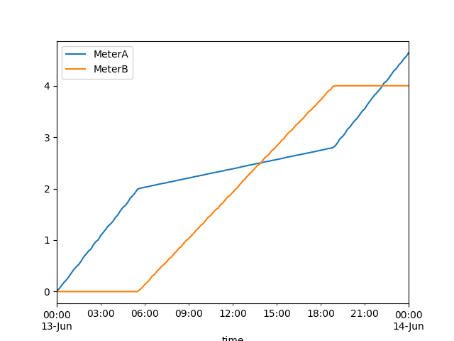

# PVSimulator: PV Simulator Challenge

This Simulator prepares for PV simulator challenge and include to run RabbitMQ and to simulate PV power values. 

## Requirements

To run this project, you will need the following:

- Python 3.8+
- Docker
- Docker Compose
- RabbitMQ
- Pandas
- matplotlib

## Setup

### Activate the virtual environment:

1. **Create the virtual environment:**

    ```sh
    python -m venv .venv
    ```

2. **Activate the virtual environment:**
    - On Windows:

        ```sh
        .venv\Scripts\activate
        ```

    - On macOS/Linux:

        ```sh
        source .venv/bin/activate
        ```

### Install the dependencies

1. **Install the required Python packages:**

    ```sh
    pip install -r requirements.txt
    ```

## Run RabbiMQ Message broker for python: based https://github.com/pazfelipe/python-rabbitmq.git 

    Run the RabbitMQ container using Docker Compose:
    ```bash
    docker compose -f compose_files/rabbitmq-python.yaml up -d
    ````
    Close Container :
    ```bash
    docker compose -f compose_files/rabbitmq-python.yaml down
    ````
### Note

The RabbitMQ management console can be accessed at [http://localhost:15672](http://localhost:15672).

## Define Publisher classes in src/publisher.py
### Publish a message

1. **Run the publisher script to publish a test message:**

    ```sh
    python3 src/publisher.py
    ```

## Define Consumer classes in src/consumer.py
### Consuming messages

1. Run the consumer script to consume and save test messages: May create Images directory with 
    ```basg
    mkdir Images (in PVSimulator)
    ```
    Then run
    ```sh
    python3 src/consumer.py
    ```

# Replication Meter data

For simulation reading meters, I assume that MeterA is the amount of electricity from line and MeterB is the amount of generated electricity of PV,
so the usage of house is the summation of MeterA and MeterB.

Assumption Reading: Read amount of the both meters at the same time and publish which may be different time differences.
Assumption Comsuming: Consumer save published time, meter of MeterA, meter of MeterB, Sum(MeterA + MeterB), Generated exlectrricity from PV (in KWH * 10, scaled for better comparison) for each publication for more fine time scale than publisher.

Reading MeterA and MeterB in simple piecewise linear value with randam fluctuation RDelta in Publisher.



From MeterA and MeterB with Rerading time, construct Sum and PV Power generation with finer time difference CDelta in Consumer.
The data are stored in csv file (./Images/power.csv) format because we need to append date for each reading time.
After given ending time, consumer plot the data according to time in ./Images/fig_power.png.


## After finish consuming messages, one have to stop Consumer in this test

Cunsumer is waiting to publish messages until error or Keystroke to stop waiting

## Further modification: Wait more messages or spend time before consume messages


# Running with Container:
## Clone PVSimulator from github

    ```bash
    git clone https://github.com/kangkabseok2021/PVSimulator.git 
    ```

## Docker Build: In PVSimulator

    ```bash
    docker build -t pv-simulator .
    ````

## Run the RabbitMQ container using Docker Compose: In PVSimulator
    ```bash
    docker compose -f compose_files/rabbitmq-python.yaml up -d
    ````

## Run conrtainer: Run mkdir Images In PVSimulator if it needed

    ```bash
    docker container run --network host -it -v ./Images:/PVSimulator/Images pv-simultor bash
    ```

### Run publisher and consumer inside container: Need to stop consumer manually